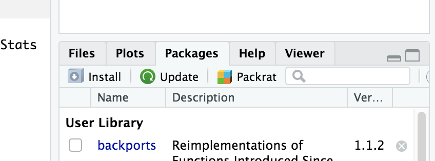
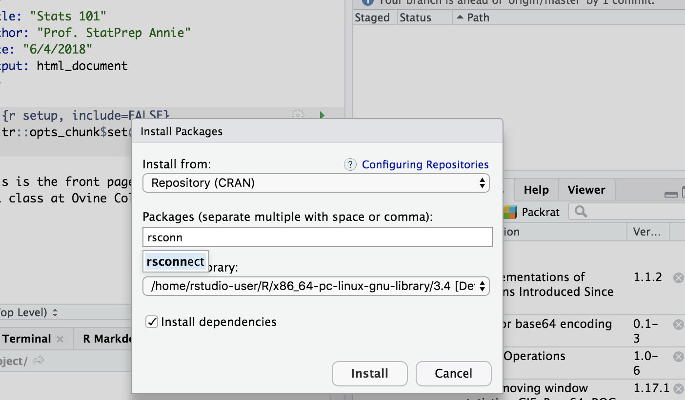
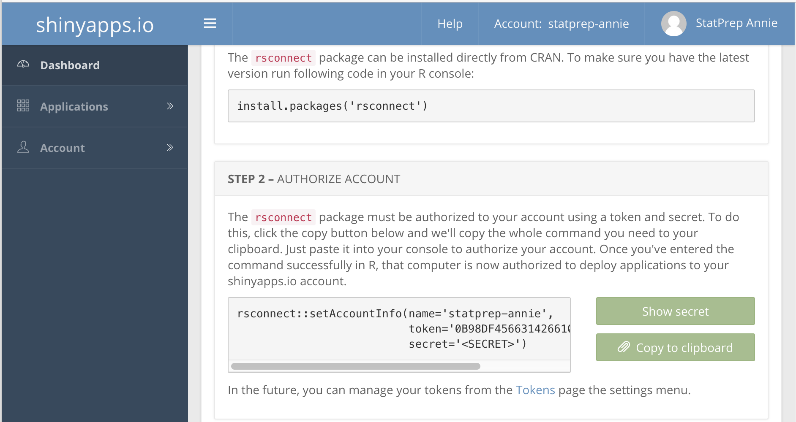
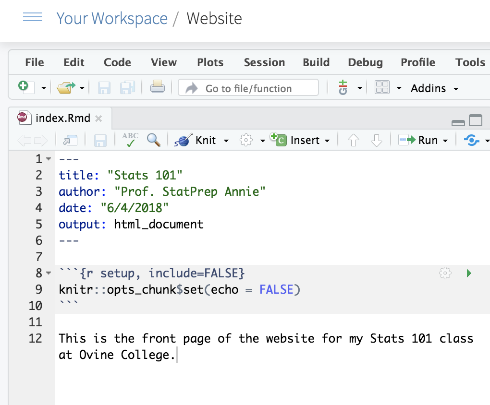
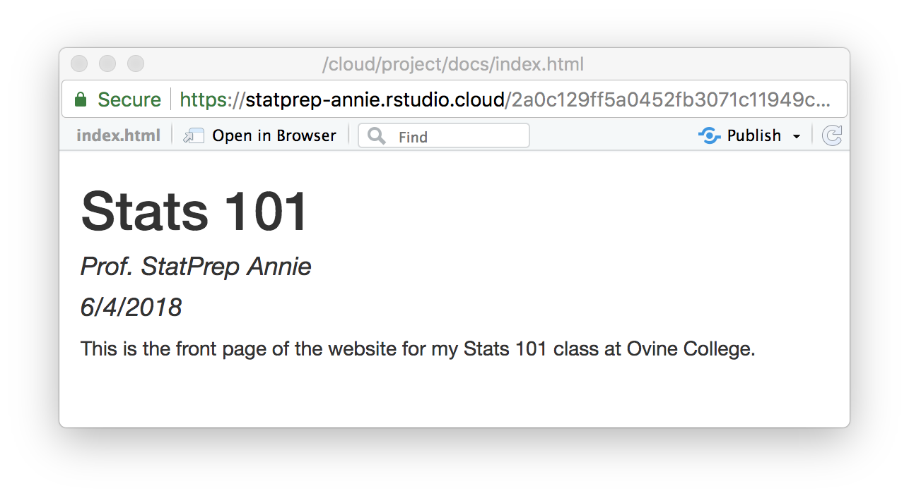

# StatPrep Annie

```{r setup, include=FALSE}
knitr::opts_chunk$set(echo = TRUE)
```

StatPrep Annie is a persona created to depict a real-world StatPREP instructor who is setting up their statistics course.

```{r echo = FALSE, fig.cap = "StatPrep Annie", fig.align="center"}
knitr::include_graphics("images/Annie-thumbnail.png")
```

She's got a website for her course, a couple of interactive lessons, and so on.

Here's how she set them up and uses them to communicate with her students, write the occasional homework assignment, and so on.

## Setup

Annie had a gmail account already, `StatPrep_Annie@gmail.com`. She used this account to set up cloud accounts on:

* [rstudio.cloud](http:/rstudio.cloud)
* [shinyapps.io](http://shinyapps.io)

Use your own gmail account to set up accounts for your own use. If you don't have a gmail account, you can set one up as described in Section [#github].

## Authorizing rstudio.cloud to publish

You need to authorize `rstudio.cloud` to publish to your `shinyapps.io` account. How do you do this? The general idea is that you login to `shinyapps.io` and ask it to tell you a secret. Then, from `rstudio.cloud`, you send that secret back to `shinyapps.io`. Once `shinyapps.io` knows that `rstudio.cloud` is in on the secret, shinyapps will accept future commands from you `rstudio.cloud` account.

1. Login to your account on `rstudio.cloud`.
2. Open any project on `rstudio.cloud`.
    - From the RStudio interface, select the "Packages" tab and press "Install".
    ```{r echo = FALSE, fig.align="center"}
    
    ```
    - In the dialog box that appears, start typing `rsconnect`. At some point, the dropdown menu will show that choice. Click on that and press "Install".

```{r echo = FALSE, fig.align="center"}
    
    ```
3. Login to `shinyapps.io`. Select the "Dashboard" tab. You'll see a section entitled "Authorize account" with a display of computer code and a "copy to clipboard" button. Press that button. 
    ```{r echo = FALSE}
    
    ```
    Depending on your browser, you may be asked to press CNTR-C to copy the code.

4. Return to the console in `rstudio.cloud` and paste in the code you copied in (3).

## Publishing your website

1. From your rstudio.cloud account, open your website project. In that project, open the `index.Rmd` file.  Press "Knit".

```{r echo = FALSE, fig.align="center"}

```

2. In response to your pressing "Knit", RStudio will do some work and in a couple of seconds put up a window looking like this:



Press the "Publish" button.
    - Select "RStudio Connect"
    - Select "Publish finished document only"
    - In the dialog box titled "Select RStudio Connect Account", type the address `shinyapps.io`.

