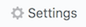
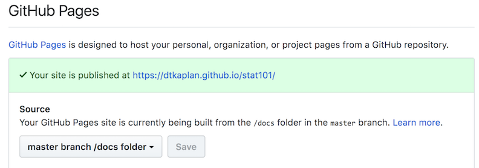

--- 
title: "StatPREP: Instructor Notes"
author: "Daniel Kaplan"
date: "`r Sys.Date()`"
site: bookdown::bookdown_site
output: bookdown::gitbook
documentclass: book
bibliography: [book.bib]
biblio-style: apalike
link-citations: yes
github-repo: statprep/statprep-book
description: "Notes for instructors teaching with StatPREP materials"
always_allow_html: yes
---

# Your course web site

As statistics instructors start using data in their classes, they find that they need to make data files available to students. An excellent way to do that is to put the files on a web site, so that the students can access them with a URL.

If your institution uses course support software such as Blackboard or Moodle, you may want to take advantage of those resources.

Many instructors don't have a web server available to them and aren't sure how to set up a web site. (And, warranted or not, many instructors grumble about Blackboard and Moodle) The point of this repository is to help you set up your own course web site on which you can place data files, etc. so that your students can easily get to them.


You don't need to know even what a "repository" is. You'll be able to add files to your web site and edit documents from an ordinary brower.

The main resource we'll use is *GitHub*. This is a free service that's very widely used by software engineers. We won't have to do any engineering, but you'll have to follow a few instructions.

At this point, make sure that you have a GitHub account. (See \@ref(signing-up-for-cloud-services.html).)

## Setting up your web site

1. Open up another browser window, so that you can look at these instructions at the same time as you are working on your site.
1. Login to GitHub in the browser window you opened in (1).
2. Open up one of the following links in the other browser window.
    - [One-file web site](https://github.com/StatPREP/one-page-website)
    - [RStudio edited web site](https://github.com/StatPREP/website-template)
    These are both "repositories" under the StatPREP organization.
3. Whichever option you selected in (2), find the "Fork" button in the upper right-hand corner of the StatPREP repository. Chances are, you'll be asked whether you want to set this up in your own account. You do. 

At this point, you should have two browser windows open. One for these instructions, the other for your GitHub repository. You are going to be working in the GitHub repository window.

4. Press the  button. In the page that appears ...

    a. Change the name of the repository to something appropriate for your course. Stat_105? Keep it short and don't use any spaces. Use underscores instead.
    b. Scroll down to the settings section headed GitHub pages. 
    
    Select the drop-down menu to read "master branch /docs folder".
    c. Copy the link that follows "Your site is published at ...." This is the link you will give your students. Note that it is formed from your GitHub ID and the repository name. That's why you want both of these to be memorable.
    
5. Try it out by pasting the link into the URL bar for another browser tab.

6. Oh ... you might want to customize the content before you give the link to your students.

## Customizing the site content.

How you are going to customize the content depends on whether you chose to create a one-page web site or a site that you can edit with RStudio.

### One-page web site customization

When you are setting up your repository, you will be logged into GitHub and at a URL like this: `github.com/`*your_user_ID*`/`*your_course_name*.

When your students look at the repository, or when you make links to data files, etc., the URL will look like *your_user_ID*`.github.io/`*your_course_name*. Make sure it's clear to you how the GitHub user URL differs from the URL for students.

We're going to do some setup for your site, e.g. customizing the front page, adding data files, etc. So check that you are looking at your GitHub repository: `github.com/`*your_user_ID*`/`*your_course_name*. 

You can see a list of files, starting with a folder called "docs". The docs folder is where you will put all of the materials for your web site. Click on the name "docs" and you will see what files are already in the directory.  There are two:

- `test.csv` - a really small CSV data file
- `index.md` - a text file containing the front page of your new site.

What might confuse you is that the site URL from the students' point of view is something like `http://`*your_user_ID*`.github.io/`*your_course_name*, which does not include the word `docs`. Get used to it. The URL really does point to the `docs` directory. And, since there is a file called `index.md` in the `docs` directory, per the standard behaviour of web sites the contents of `index.md` are what will be displayed when someone points their browser to your `github.io` site.

Mostly, you're going to do two things with your site:

1. Upload data files from your own computer into the `docs` folder on your site. Conveniently, there is an "Upload Files" button just for this purpose.
2. Edit the `index.md` file. To do this, click on the name `index.md`, which will open the file. You will see a little pencil icon; press that to edit the file. When you're done with your edits, scroll down and press the green "Commit changes" button. That simply saves your work. As soon as you've done this, the modified page is live on your web site, but it might take a few minutes and a refresh of your browser to see it.

#### Putting links to data files on your own course web site

If you are going to use your site to provide student access to data sets of particular interest to you, you will want to put links and instructions on your course web site.

The markup that you include in your `index.md` file (in the `docs/` directory) might look like this:

````
## Google files used in class

- `Survey1 <- gs_read(gs_key("1ucevNh7wKLtOukyEpacUKi5_-KZUQGtIOONhWRnnnQ4"))`

## Data files

Data files for this week:

- `https://dtkaplan.github.io/stat101/test.csv`

To create the data table in your R session, copy and paste 
this command into your console:

```r
My_data <- read.csv("https://dtkaplan.github.io/stat101/test.csv")
```
````

### Customizing your site with RStudio

Outline:

- clone the repo
- open a new project in RStudio, choosing the option for a GitHub repository.
- Edit as needed. Every file you edit should be "knitted" to HTML.
- State, commit, push, and pull.


 


