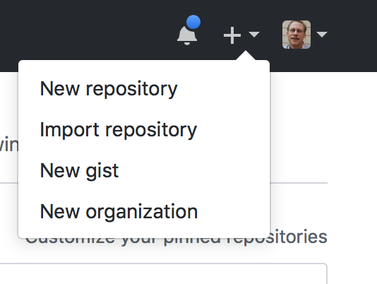
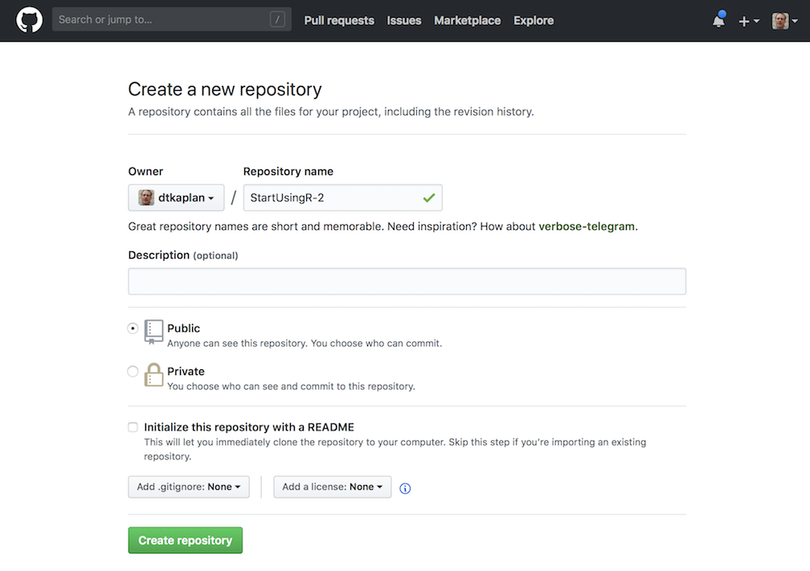
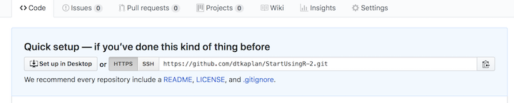
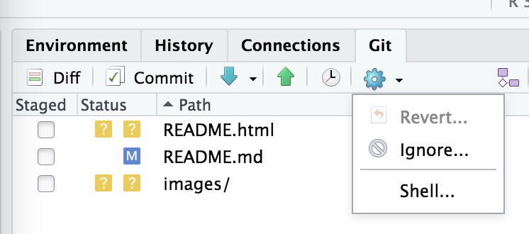
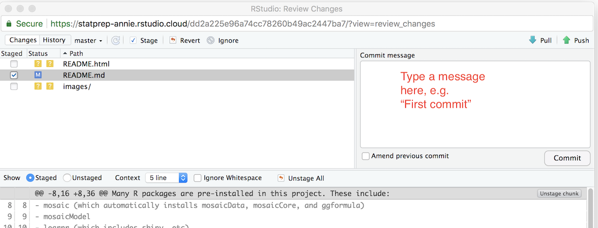

--- 
title: "StatPREP: Instructor Notes"
author: "Daniel Kaplan"
date: "`r Sys.Date()`"
site: bookdown::bookdown_site
output: bookdown::gitbook
documentclass: book
bibliography: [book.bib]
biblio-style: apalike
link-citations: yes
github-repo: statprep/statprep-book
description: "Notes for instructors teaching with StatPREP materials"
always_allow_html: yes
---

# Your course web site

As statistics instructors start using data in their classes, they find that they need to make data files available to students. An excellent way to do that is to put the files on a web site, so that the students can access them with a URL.

If your institution uses course support software such as Blackboard or Moodle, you may want to take advantage of those resources.

Many instructors don't have a web server available to them and aren't sure how to set up a web site. (And, warranted or not, many instructors grumble about Blackboard and Moodle) The point of this repository is to help you set up your own course web site on which you can place data files, etc. so that your students can easily get to them.

## Starting point ...

We'll assume that you have already created an RStudio project, perhaps simply by copying StatPrep Annie's "StartUsingR" project to your own rstudio.cloud account, as described in Chapter [#StatPrep_Annie]

## Creating a GitHub repository for your project

Leaving your RStudio.cloud tab for a few moments, you're going to create a new repository on GitHub to use for publishing web pages from your project.

1. Login to GitHub. Once you have done this, access the +v dropdown menu in the upper right of the GitHub display:

    
    
    Select "new repository"

2. In response to your selecting "new repository," GitHub will display a set-up page:

    
    
    - Choose a suitable name for the repo. For instance, if this is to be a course site, you might use the name of the course, e.g. `Stat101`.
    - Once you have set the new repository's name, skip directly on down to the green "Create repository" button. Press it
    
3. GitHub will now display a "Quick setup page." Near the top will be a section that looks like this:

    

Note the repo URL that appears in the editing box. It is composed from your GitHub user name and the name you selected for the repository. Keep that handy. Later, you're going to paste that URL into a command.


## Connecting your RStudio project to GitHub

Your task now is to connect your own copy of the StartUsingR project to GitHub. To do this, go back to your rstudio.cloud tab displaying your project.

1. In the Git tab in RStudio, select the "gear" menu and then "shell." 
    

    This will open up a new tab called "Terminal", next to the console.

2. In the Terminal tab, cut and paste these commands, making sure to **provide your own email address and name** rather than StatPrep Annie's. (If you have multiple email addresses, or multiple names, you can use any of them!) 

    ```r
git config --global user.email "StatPrep.Annie@gmail.com"
git config --global user.name "StatPrep Annie"
```
    Press enter. There will be no response by the computer. You're going to be using the terminal tab later, as well.

3. Give the command, in the terminal tab, that will instruct RStudio to refer to your GitHub repository. The command will look like the following, but **you must** change `USERNAME` to be your own GitHub username, and change `REPOSITORY` to be your own repository, set up in Step (1) of this section.
```
git remote set-url origin <paste_your_repo_URL_here>
```
    Again, when you press "enter", the computer will not respond.

4. In RStudio, open up some file, say, `README.Rmd`, and make some trivial change, such as adding a space after the document title. Then save the file.

5. In RStudio, go to the Git tab. You will see the name of the file you just edited (and maybe some others). Check the little box under "Staged" to the left of the file name. Then, press Commit.

6. A new window will open that looks like a bigger version of the Git tab. 

    

    Write some short message in the box and press the "commit" button underneath the message box. 

7. Almost done ... Press the green upward pointing arrow above the message box. You will be prompted to enter your GitHub account ID and password. Do so.

8. Now back to your GitHub account. Go to the repository you set up and press "settings." Under gh-pages in settings, select "master branch docs folder." In response, a github.io URL will appear in the gh-pages section. That's the address of the web site.

In a few minutes, you should be able to access your new web page using your own GitHub.io address.

#### Putting links to data files on your own course web site

If you are going to use your site to provide student access to data sets of particular interest to you, you will want to put links and instructions on your course web site.

The markup that you include in your `index.md` file (in the `docs/` directory) might look like this:

````
## Google files used in class

- `Survey1 <- gs_read(gs_key("1ucevNh7wKLtOukyEpacUKi5_-KZUQGtIOONhWRnnnQ4"))`

## Data files

Data files for this week:

- `https://dtkaplan.github.io/stat101/test.csv`

To create the data table in your R session, copy and paste 
this command into your console:

```r
My_data <- read.csv("https://dtkaplan.github.io/stat101/test.csv")
```
````

### Customizing your site with RStudio

Outline:

- clone the repo
- open a new project in RStudio, choosing the option for a GitHub repository.
- Edit as needed. Every file you edit should be "knitted" to HTML.
- State, commit, push, and pull.


 


