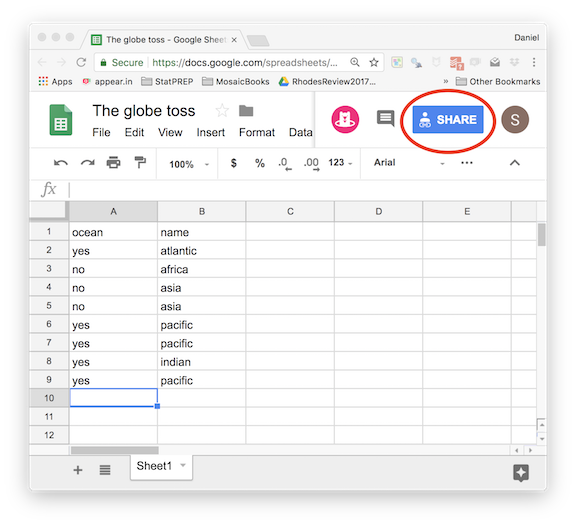
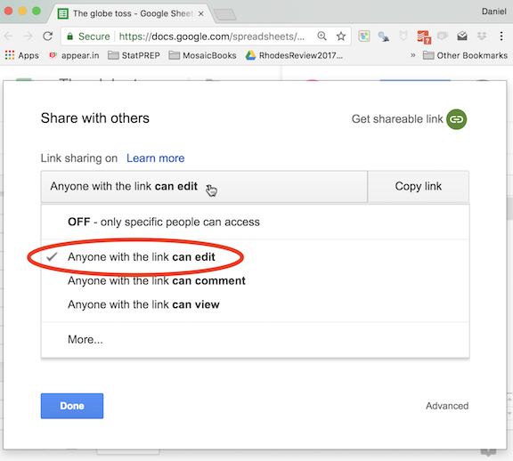
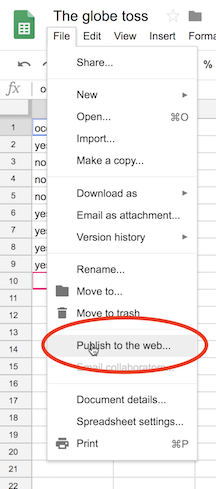
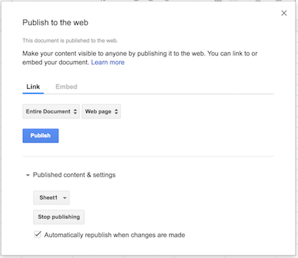

--- 
title: "StatPREP: Instructor Notes"
author: "Daniel Kaplan"
date: "`r Sys.Date()`"
site: bookdown::bookdown_site
output: bookdown::gitbook
documentclass: book
bibliography: [book.bib]
biblio-style: apalike
link-citations: yes
github-repo: statprep/statprep-book
description: "Notes for instructors teaching with StatPREP materials"
always_allow_html: yes
---

# Class data using Google Sheets

Collecting data interactively with students has several benefits:

1. Students see the connection between the data and their own actions. Students are especially motivated when the data is about them or something they are doing.
2. The inevitable imperfections in user-entered data serve as a lesson in coding factors and the measuring variables in a standard way.
3. The instructor (or individual students) can analyze the data and see how the analysis changes in real time, as more data rows are added.

## Resources

Two example lessons, from the StatPREP 2018 Workshops are:

* [Globe toss](http://dtkaplan.shinyapps.io/tutorial_globe_toss.png)
* [Riverboat card trick](http://dtkaplan.shinyapps.io/Tutorial_Riverboat_shuffle.png)

You're welcome to use those interactive documents. Each document has a link to the spreadsheet for entering data. It's your own choice whether to start by clearing out any existing rows or add on to the rows from another session. **NOTE**: No guarantee that your class's data will be there later on, since someone else might have erased it. And so you might want to set up your own spreadsheet exclusively for your class's use.

The section below on *Setting up a new spreadsheet* shows how to create a spreadsheet for your class. Note that you should post the link to your spreadsheet on your course website, so that students can access it to enter data.

For data analysis, you have a choice of options:

1. Use the [Read class data](http://dtkaplan.shinyapps.io/Lesson_read_class_data.png) activity. The user will have to paste the command to read in your spreadsheet at the start of every command block. (See *Setting up a new spreadsheet*.)
2. Use your own R session. Again, you will need to give the command to read in your spreadsheet into the console. 
3. Create your own tutorial document in Rmd. This presumes that you are comfortable editing Rmd documents and, if you want to give your students access, publishing them on a server. A working template is available via the StatPREP Workshops2018 project on `rstudio.cloud`. ([Follow this link.](https://rstudio.cloud/project/38547) to the file `Google_data_template.Rmd`.)

## Setting up a new spreadsheet

You can modify this document to work with a spreadsheet of your own. Here's how.

1. Set up a Google spreadsheet. It's a good idea to populate it with some variable names and a few values. This will let you test to make things are working before you start the activity in class.
2. *Within* the Google spreadsheet document press the "Share" button.

    ```{r echo = FALSE}

```
    
3. After you press "Share," you will see a dialog box. 

    ```{r echo = FALSE}

```
    
    - Pull down the menu to select "Anyone with the link **can edit**." (This is what lets your students add data.) 
    - Copy the link and paste it somewhere you can get to it again. You'll need it. The link will look like this: `https://docs.google.com/spreadsheets/d/1ucevNh7wKLtOukyEpacUKi5_-KZUQGtIOONhWRnnnQ4/edit?usp=sharing`
    - You will also need to copy the *key* that's contained in the link. The key is just the central gibberish in the link, like this: `1ucevNh7wKLtOukyEpacUKi5_-KZUQGtIOONhWRnnnQ4`
        
        
4. Put the link on your course web site so that your students can get to it. That's how they will access the spreadsheet for entering data.

5. Back in your Google sheet, select the File/Publish_to_the_web menu item. Use the resulting dialog box to publish the entire document. 

&nbsp;

6. Create the R command that will load the spreadsheet data into your R session. 
    ```r
Globe <- gs_read(gs_key("1ucevNh7wKLtOukyEpacUKi5_-KZUQGtIOONhWRnnnQ4"))
```
    In forming the command, replace the quoted string in the above with your own key. The key is located in the center of the link to the spreadsheet: an incomprehensible set of characters similar to that highlighted in **bold** in the example in step (3). You might also replace `Globe` with a name that's more suited to your own activity. 
    
    Paste the command you've created someplace handy. You'll need it. (Suggestion: Paste it next to the link in step (4).)
    
Time for class!    
    
7. Once you reach the point in your class where you want to do statistics on your data, bring up the lesson document provided for this purpose by StatPREP [located here](http://dtkaplan.shinyapps.io/Lesson_read_class_data.png). That document has several R command chunks, all of which are blank. You can put any R commands in those chunks, **but make sure** that the command from step (5) always is the first command in any chunk that you use. That way, whenever you run the code in the chunk, the data will be read in from Google. Keep in mind that the chunks are all independent of one another, so you'll need to read in the data in any chunk you use.

Try it out in the following command chunk:

a. Paste in the command you created in step (5).
b. Below that, add any R commands you like.

```{r testme, exercise=TRUE, exercise.cap="Try reading your own document.", message = FALSE}

```

    
For instructors who want to write their own tutorial, you will find that this simplifies things since you can arrange to have the spreadsheet data read-in globally and not have to put the data-reading command in every chunk. Use the template `.Rmd` document provided by StatPREP [here](). Modify the chunk named `read_data` the top of the document by inserting your own command (with your own key). Notice that in any new chunk you create, you'll have to reference the `read_data` chunk as the `exercise-setup`. The chunks already in the template document do this, so you can just copy (and rename!) an existing chunk. 


